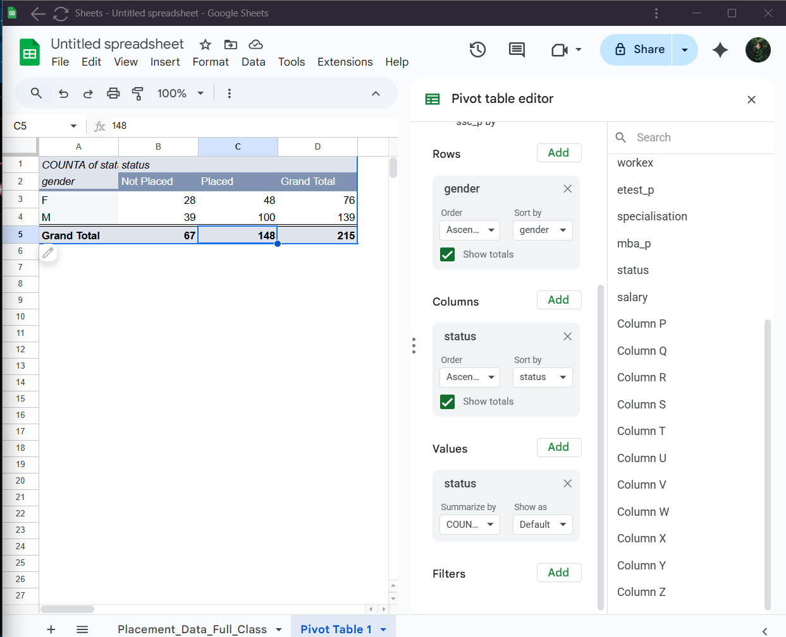

Project 1: Campus Recruitment Fairness Audit 🏹🛡️

Business Task: Identify if recruitment outcomes are influenced by gender or degree specialization rather than academic performance alone.

Definitions Applied:

Fairness: Analyzing if the placement process provides equal opportunity regardless of gender.

Attributes: Using gender, degree_t, and ssc_p to categorize student data.

Oversampling (Concept): I identified that if one gender is significantly underrepresented, we would need to oversample to ensure a balanced analysis.

Tools Used: > * Google Sheets (for data cleaning and pivot tables).

GitHub (for documentation and version control).

---
### **Project Results & Key Insights** 📊
After performing a **Fairness Audit** using Pivot Tables, I uncovered a clear hiring gap:

* **The Gender Gap:** Males had a placement rate of **71.9%** (100 out of 139), while females were placed at a rate of **63.1%** (48 out of 76).
* **The Evidence:** My audit shows nearly a **9% difference** in favor of male candidates.
* **Analysis:** This discovery moves the project from simple data viewing to "Root Cause" investigation. 

